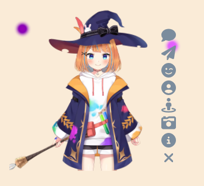

# <center>yan_Live2d-Widget-v3

---

## 1 介绍

+ **演示地址**：[DEMO](https://github.com/yunmoxing/yan_live2d-widget-v3)
+ **文章教程**：莱特雷大佬[【Hugo】博客引入moc3类型的live2d模型](https://letere-gzj.github.io/hugo-stack/p/hugo/live2d-moc3/)



> [!NOTE]
> + （1）此项目是基于【[stevenjoezhang/live2d-widget](https://github.com/letere-gzj/live2d-widget-v3)】项目的二次开发
> + （2）可直接跳转到他的[仓库](https://github.com/letere-gzj/live2d-widget-v3)查看具体内容

> [!TIP]
>  + **Tips:** 此项目暂适配moc3模型，并不适配moc模型，且暂时未考虑适配moc模型

---

## 2 使用方法

### 2.1 基础引入

+ 在页头(head)或页脚(footer)引入以下脚本代码，演示的模型是官方SDK自带的模型
```html
<script>
  const cdnPath = 'https://cdn.jsdelivr.net/gh/yunmoxing/yan_live2d-widget-v3@main';
  const config = {
    // 资源路径
    path: {
      homePath: '/',
      modelPath: cdnPath + "/Resources/",
      cssPath: cdnPath + "/waifu.css",
      tipsJsonPath: cdnPath + "/waifu-tips.json",
      tipsJsPath: cdnPath + "/waifu-tips.js",
      live2dCorePath: cdnPath + "/Core/live2dcubismcore.js",
      live2dSdkPath: cdnPath + "/live2d-sdk.js"
    },
    // 工具栏
    tools: ["hitokoto", "asteroids", "express", "switch-model", "switch-texture", "photo", "info", "quit"],
    // 模型拖拽
    drag: {
      enable: true,
      direction: ["x", "y"]
    },
    // 模型切换(order: 顺序切换，random: 随机切换)
    switchType: "order"
  }

  // 加载资源并初始化
  if (screen.width >= 768) {
    Promise.all([
      loadExternalResource(config.path.cssPath, "css"),
      loadExternalResource(config.path.live2dCorePath, "js"),
      loadExternalResource(config.path.live2dSdkPath, "js"),
      loadExternalResource(config.path.tipsJsPath, "js")
    ]).then(() => {
      initWidget({
        homePath: config.path.homePath,
        waifuPath: config.path.tipsJsonPath,
        cdnPath: config.path.modelPath,
        tools: config.tools,
        dragEnable: config.drag.enable,
        dragDirection: config.drag.direction,
        switchType: config.switchType
      });
    });
  }

  // 异步加载资源
  function loadExternalResource(url, type) {
    return new Promise((resolve, reject) => {
      let tag;
      if (type === "css") {
        tag = document.createElement("link");
        tag.rel = "stylesheet";
        tag.href = url;
      }
      else if (type === "js") {
        tag = document.createElement("script");
        tag.src = url;
      }
      if (tag) {
        tag.onload = () => resolve(url);
        tag.onerror = () => reject(url);
        document.head.appendChild(tag);
      }
    });
  }
</script>
```

---

